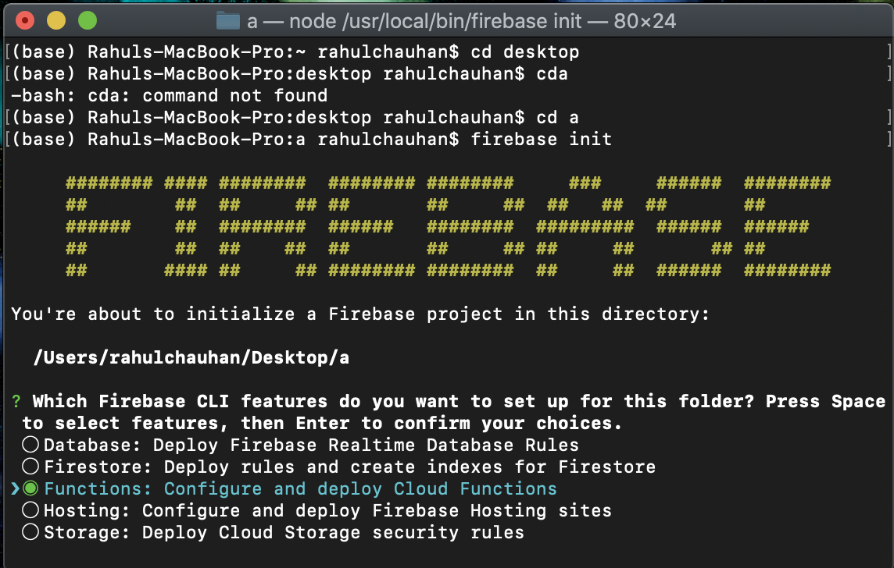
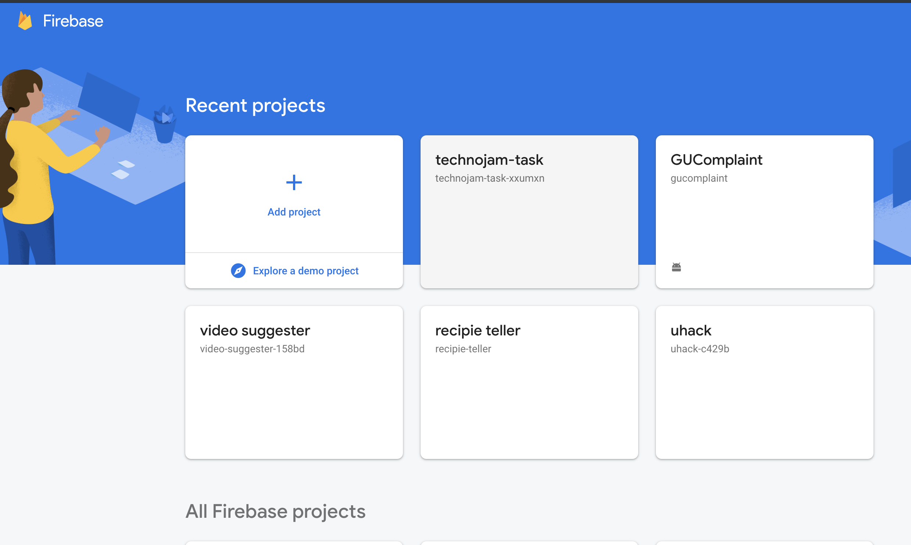
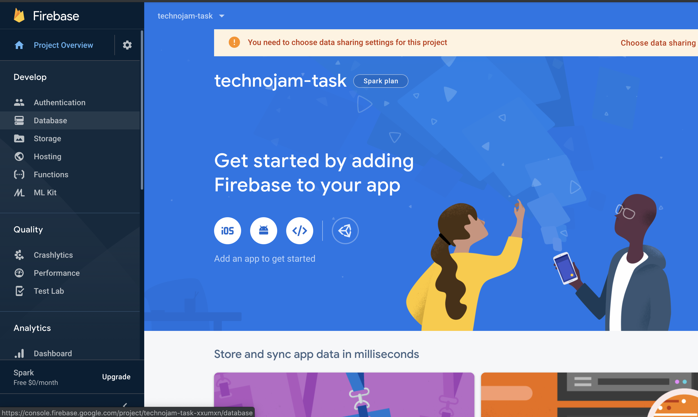
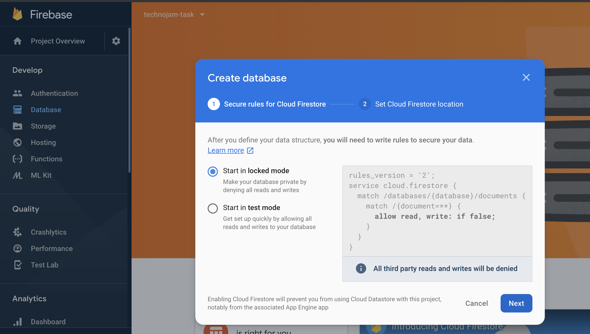
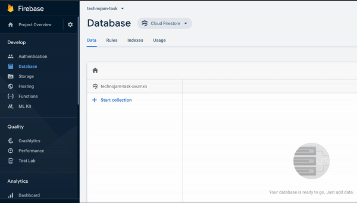
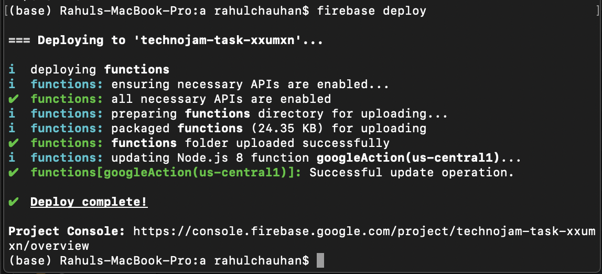
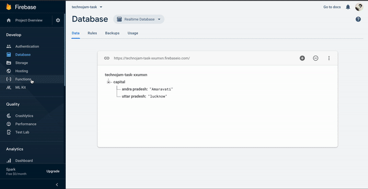

# Task 2
Note: Before installing firebase cli, you need to download and install npm which typically comes with [Node.js](https://nodejs.org/en/)

### Step 1: Download and install node.js from link given above.
### Step 2: Install the Firebase command-line interface
- To install or upgrade the CLI run the following npm command on terminal (or cmd for windows):

``` 
npm -g install firebase-tools
```
- To verify that the CLI has been installed correctly, open a terminal and run:

``` 
firebase --version
```

### Step 3: Authorize the Firebase CLI by running
``` 
firebase login
```

### Step 4: Firebase init
- Before initializing project change your working directory to somewhere where it's easily available for example desktop
- To do that create an empty folder on desktop and name it 'task'

- Run the following command on terminal to change directory
```
cd desktop/temp
```
- Run Following commands to initialize the project
```
 firebase init
```
- scroll down to functions and press space to select it.



- Press enter
- Selecct 'use existing project' and press enter
- select your project for example 'technojam-task-...' here, and press enter


- Select javascript and press enter
- You may see following line in your screen

```
? Do you want to use ESLint to catch probable bugs and enforce style? (y/N)
```
- Type 'n'  without quotes and press enter

- Next line will be
``` 
? Do you want to install dependencies with npm now? (Y/n) 
```
- Type 'y' and press enter
- Wait for dependencies to get installed

### Step 5: Create Database
- Open 
[firebase console](https://console.firebase.google.com/) and select your project (For example: technojam-task)



- click on Database located on left of your screen


 - Click on create Database and click next

 

 - Select default location and click on done
 - Accept terms and click finish
 - Click on realtime database and enter data of capitals as shown below

 

 ### Step 6 Coding
 - Go to directory where you initialize firebase project.(Desktop/temp)
 - Inside functions folder, click on index.js
 - Replace the code inside index.js with the following code
 ``` javascript
 "use strict";
Object.defineProperty(exports, "__esModule", { value: true });
const functions = require("firebase-functions");
const admin = require("firebase-admin");
admin.initializeApp();
const db = admin.database();
const { dialogflow} = require('actions-on-google');
const app = dialogflow({
    debug: true
});

app.intent("capital", conv => {

    const stateName = (conv.parameters['stateNames']);
    return db.ref("capital/").once("value", snapshot => {
        const data = snapshot.val();
        const capitalName = data[stateName]
        conv.close(`The capital of ${stateName} is ${capitalName}`) 
    });
});

exports.googleAction = functions.https.onRequest(app);
```
- save index.js and open package.json
- Inside the dependencies add following line
``` 
"actions-on-google": "2.11.0"
```
 - Your package.json should now looks similar to this
 ``` 
 {
  "name": "functions",
  "description": "Cloud Functions for Firebase",
  "scripts": {
    "serve": "firebase serve --only functions",
    "shell": "firebase functions:shell",
    "start": "npm run shell",
    "deploy": "firebase deploy --only functions",
    "logs": "firebase functions:log"
  },
  "engines": {
    "node": "8"
  },
  "dependencies": {
    "firebase-admin": "^8.0.0",
    "firebase-functions": "^3.1.0",
    "actions-on-google": "2.11.0"
  },
  "devDependencies": {
    "firebase-functions-test": "^0.1.6"
  },
  "private": true
}
```
- open terminal(make your directory is still desktop/temp)
- Type following command
```
cd functions
npm install
cd ..
```
- After that, type:
```
 firebase deploy
```
- You should get deploy successful message



- After deploying successfully go to firebase functions, copy url, paste it on fulfilment and save. Make sure fulfilment is enabled in intent. 



___
And that's it. 